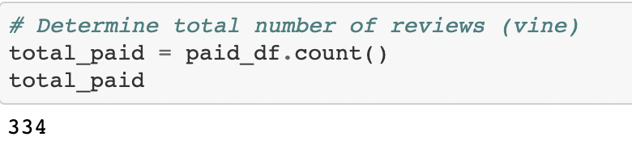
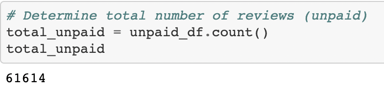
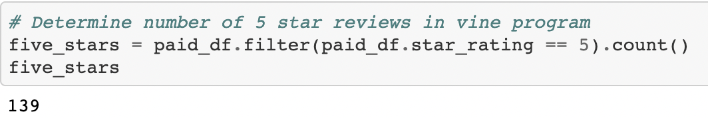
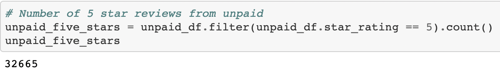
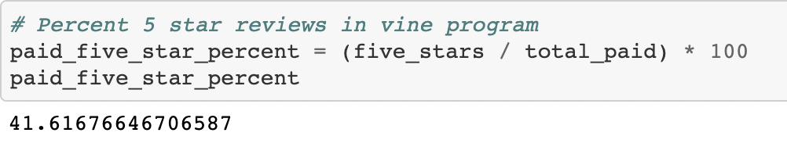
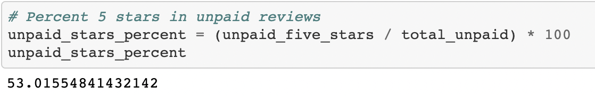

# Amazon_Vine_Analysis
PySpark, SQL (pgAdmin 4)

## Overview of the Analysis
The Amazon Vine program allows manufacturers to receive reviews for their products. Members of the program are paid to receive and review said products to give these companies additional feedback. The object of this analysis is to determine whether or not there is bias toward favorable reviews from Vine members. The dataset in focus features sporting products with reviews from Vine members as well as non-Vine members. In order to execute this procedure, the data from the sports dataset will need to be extracted, transformed and loaded into pgAdmin. Using PySpark in Google Colab, the data will be loaded into the SQL database after connecting an AWS RDS instance. The Relational Database Service (RDS) is a link between the pgAdmin 4 and the PySpark interface. Once the data is loaded into the SQL tables, we can then search for any bias related to Vine members or non-Vine members.  

## Results
### Reviews

After running the code displayed in the images above, there was a total of 61,948 reviews 
- 334 Vine reviews
- 61614 non-Vine reviews

### 5-Star Reviews

After running the code displayed in the images above, the number of 5-Star reviews are as follows:
- 139 Vine
- 32665 non-Vine

### Percentage 5-Star

The final part of the analysis lists the percentages for both Vine and non-Vine members:
- 41.62% of the Vine reviews are 5-Stars
- 53.02% of the non-Vine reviews are 5-Stars

## Summary
The final analysis suggests there is no evidence to support bias from Amazon Vine members when reviewing sporting products from various manufacturers. only 41.62% of the reviews from Vine members are 5-Stars, compared to the 53.02% of reviews from non-Vine members. Just because the percentage of 5-Star reviews from Vine members is lower than non-Vine members does not absolutely mean there is a lack of bias. Enhancing our confidence in the absence of bias could be performed through another analysis involving ratings for the'product parent' or the company/manufacturer. Different producers have different ratings, and depending on the amount of product from good or bad producers could have an impact on Vine/non-Vine member bias. If most of the Vine members receive products from lower ranked manufacturers it could explain discontent and lower rated reviews. In order to perform this analysis we would need the 'product parent' and the 'product parent rating'. With this information we can count the number of 5-Star products and 5-Star manufacturers per Vine member, leading us to a higher confidence in detecting consumer bias in the Amazon Vine program.   
